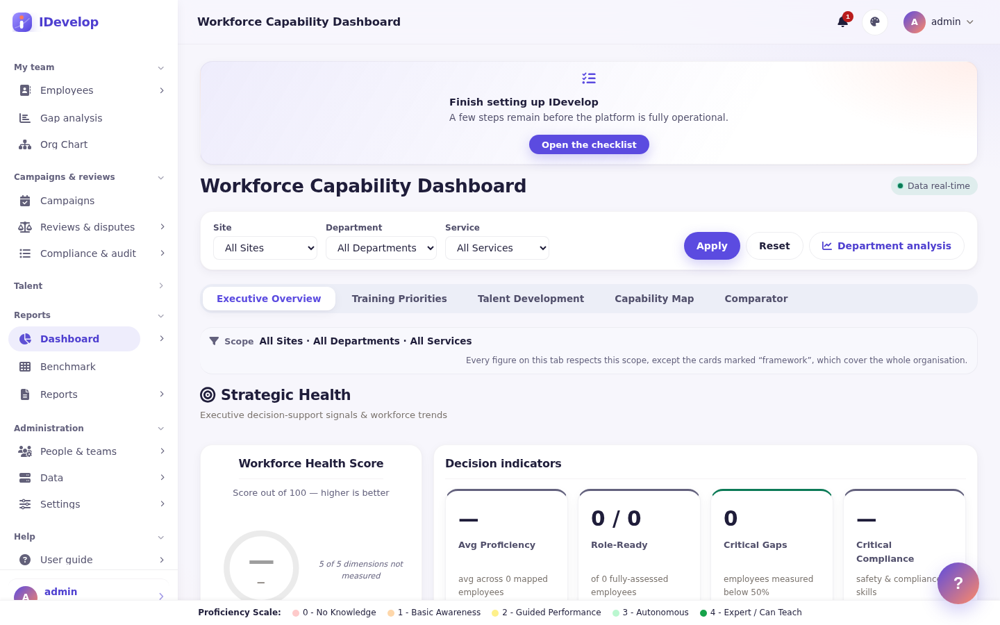
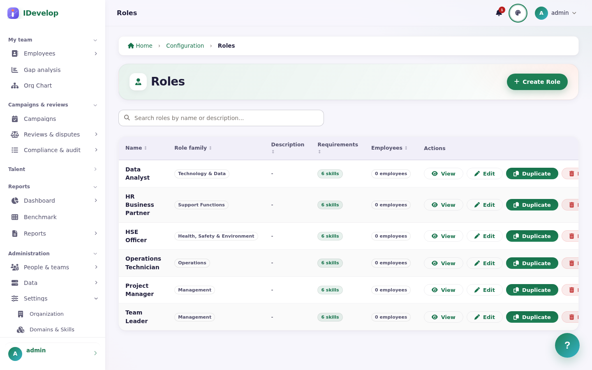
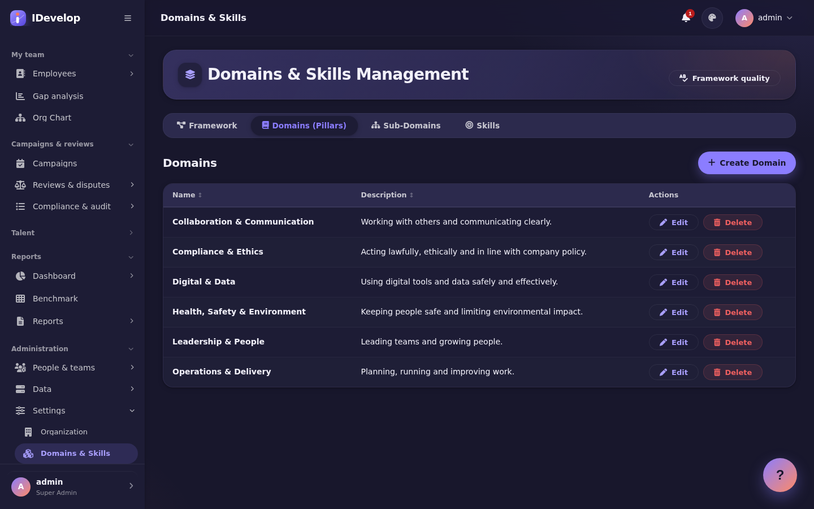
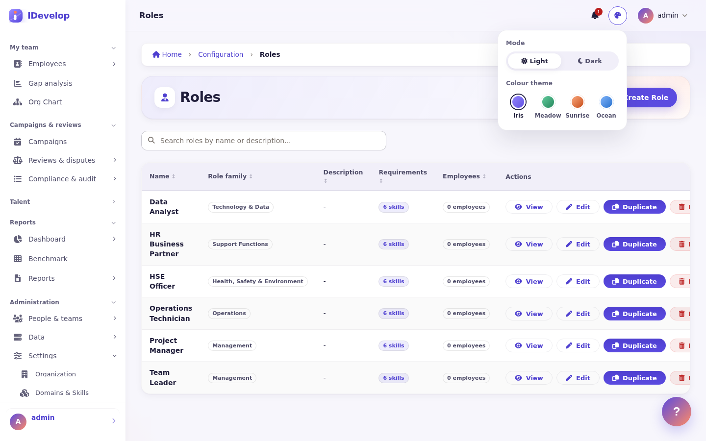

<p align="center">
  
</p>

<p align="center">
  <b>Open-source skills and talent management platform.</b><br>
  Capability frameworks · Assessments & reviews · Role readiness · 9-box & succession · Development plans · Analytics
</p>

<p align="center">
  <a href="LICENSE"></a>
  
  
  
</p>

---

IDevelop Community Edition (**IDevelop CE**) helps an organisation describe the
skills its roles need, measure the skills its people have, and act on the gap —
fairly, transparently and with a full audit trail. It runs on your own
infrastructure (a single Node.js process and PostgreSQL), keeps self-assessment
drafts on the device when the network drops, and every screen is available in
French and English.



Friendly by default: a light, airy interface with rounded surfaces, and an
**Appearance** menu where every user picks light or dark mode and one of four
colour themes — **Iris**, **Meadow**, **Sunrise** or **Ocean**.

| Meadow theme                                   | Dusk (dark) mode                                   | Appearance menu                                     |
| ---------------------------------------------- | -------------------------------------------------- | --------------------------------------------------- |
|  |  |  |

## Contents

- [Features](#features) · [What it is not (yet)](#what-it-is-not-yet)
- [Quick start](#quick-start)
- [Configuration](#configuration)
- [Tech stack](#tech-stack)
- [Project layout](#project-layout)
- [Development](#development)
- [Architecture](#architecture)
- [Branding & white-label](#branding--white-label)
- [Contributing, security, licence](#contributing-security-licence)

## Features

**Capability framework** — pillars → sub-domains → skills, role families, roles
with required levels and critical flags, 0–4 proficiency scale with level anchors
per skill category (FR/EN), Excel import/export, quality report for missing
descriptions. A generic **starter framework** (6 pillars, 34 skills, 6 sample
roles) can be loaded in one command.

**Assessment** — self-assessment campaigns, supervisor reviews with evidence,
change requests and disputes with SLA escalation, maker-checker approvals,
certification validity and expiry reminders. Self-assessment drafts are saved
on the device and sent when the network returns (the rest of the application
needs a connection).

**Readiness & analytics** — role-readiness and gap analysis that separate
_unmeasured_ from _zero_, executive dashboard, capability map, benchmark and
comparator views, report builder with scheduled delivery, department briefs,
key-person and retention risk, workforce planning signals.

**Talent** — 9-box placement and calibration (manual, one person, one position),
succession plans and coverage floors, individual development plans, coaching
plans, performance improvement plans, internal mobility postings with rule-based
matching, a team recognition feed, pulse and eNPS surveys with an anonymity
floor, **360° multi-rater feedback** (rounds or campaigns on the role skills and
behaviour statements, manager-approved raters, anonymous groups shown only from 3
answers, blind spots and hidden strengths, one click to the development plan), a
**shared one-to-one space** (joint agenda, shared and private notes, action items
linked to development objectives or goals, meeting history), and basic goals —
shown read-only beside a self-assessment under review.

**Governance & security** — fine-grained RBAC with geographic/organisational
scopes, access reviews and a tamper-evident (hash-chained) audit trail, MFA
(TOTP + backup codes), SSO (OpenID Connect incl. Microsoft Entra ID, SAML 2.0,
Google), SCIM provisioning, per-client API keys, GDPR export/erasure with legal
hold, retention policies, rate limiting, CSP with nonces.

**Integrations** — versioned JSON API (`/api/v1`, OpenAPI 3; a focused set of
endpoints, not full coverage of the UI), signed outgoing webhooks that can post
notifications to Slack or Microsoft Teams channels (one-way), SCIM user
provisioning, LMS connectors (LTI 1.3, xAPI LRS, Cornerstone), Power BI feeds,
SMTP notifications and digests. People data comes in through Excel/CSV import,
SCIM, or HRIS synchronisation: a CSV/TSV export dropped in a server folder (for
example by your own SFTP) or uploaded, and Personio and Lucca connectors, with a
dry run, value mappings and a mass-leaver guard (see
[docs/HRIS-SYNC.md](docs/HRIS-SYNC.md)); Workday and SAP connectors are still on
the roadmap.

**Assistant and copilot** — an "Assistant" tab in the help panel for every user:
how-to answers with a link to the right screen, personalised next steps, page and
concept explanations, in French and English. It is rule-based and works without
any language model; employees only ever see their own data. Managers and
administrators can also switch on an optional LLM **copilot** (off by default,
EU-hosted or on-premises providers only by default, names anonymised before
anything leaves the server, "decision support only" label on every answer). Skill
suggestions are computed from evidence (certificates, courses, plans) with
transparent rules, not machine learning.

**Operations** — health/readiness/metrics endpoints, in-process job scheduler
(or BullMQ on Redis for multi-instance), daily database backups, restore drills,
installable PWA, Windows installer, Docker image.

### What it is not (yet)

Being clear about the limits saves everyone time. Today IDevelop CE does **not**
offer:

- **advanced 360° feedback** — 360° rounds exist (role skills, behaviour
  statements, anonymity floor, link to the development plan), but there is no
  questionnaire builder, no organisation-wide norms and no PDF report yet;
- **rich OKRs** — goals are basic: the OKR cascade (company → team → person) is
  still basic and goals are not scored in review forms (they are shown there as
  context). Shared 1:1 meetings exist; there is no calendar integration;
- **Workday or SAP connectors** — HRIS sync covers a CSV/SFTP drop folder,
  Personio and Lucca (the two API connectors are not yet validated against a live
  tenant); Workday and SAP are on the roadmap;
- **an interactive Slack or Teams app** — notifications are one-way;
- **a full offline mode or a store-published mobile app** — it is an installable
  web app (PWA); only self-assessment drafts work offline;
- **languages beyond French and English**;
- **multi-tenant hosting** — one installation serves one organisation.

These are on the roadmap in [docs/PRODUCT-STRATEGY.md](docs/PRODUCT-STRATEGY.md).

## Quick start

### Option A — Docker Compose (evaluation)

```bash
git clone https://github.com/mliad313sn/IDevelop-Community-edition.git
cd IDevelop-Community-edition
cp .env.example .env
# edit .env: set SESSION_SECRET, APP_KEY and DB_PASSWORD (openssl rand -hex 32)
docker compose up -d --build
docker compose logs app | grep -A2 "FIRST-RUN SUPERADMIN"   # one-time admin password
docker compose exec app node scripts/seed-starter-framework.js --commit   # optional starter framework
docker compose exec app node scripts/seed-demo-org.js --commit          # optional: 24 fictional people to explore
```

Open <http://localhost:3000>, sign in as `admin` with the printed password,
choose a new password and enrol an authenticator app (MFA is enforced for
super-administrators). The **Setup checklist** on the dashboard walks you
through the rest.

#### Moving the compose database to PostgreSQL 18

The compose file stays on `postgres:17-alpine`; CI also runs the full suite on
PostgreSQL 18. Changing the image tag alone does **not** upgrade an existing
`pgdata` volume: PostgreSQL 18 refuses to start on a 17 data directory, and the
18 image keeps its data under `/var/lib/postgresql/18/docker`, so it expects
the volume on `/var/lib/postgresql` instead of `/var/lib/postgresql/data`.
Upgrade with a dump and restore into a new volume:

```bash
docker compose stop app
docker compose exec -T db pg_dump -U idevelop -d idevelop --no-owner > idevelop-pg17.sql
docker compose stop db
# docker-compose.yml: image postgres:18-alpine, mount `pgdata18:/var/lib/postgresql`
# (declare pgdata18 under volumes:); keep the old pgdata volume until verified.
docker compose up -d db
docker compose exec -T db psql -v ON_ERROR_STOP=1 -U idevelop -d idevelop < idevelop-pg17.sql
docker compose up -d app
```

`pg_upgrade --link` is the faster alternative for large databases, but it needs
the 17 and 18 binaries side by side (for example a one-off container built for
the purpose). Back up `pgdata` and `appdata` first either way.

### Option B — Node.js + PostgreSQL

Requirements: Node.js **20.19+** (22 LTS recommended) and PostgreSQL **16+**.
Redis is optional.

```bash
npm ci
cp .env.example .env            # set DATABASE_URL, SESSION_SECRET, APP_KEY
createdb idevelop               # or let your DBA create it
npm run db:migrate:all          # schema + all migrations (also runs on boot)
npm run db:seed:starter -- --commit   # optional: generic starter framework
npm run db:seed:demo-org -- --commit  # optional: fictional demo organisation (--clean to deactivate)
npm start                       # http://localhost:3000
```

### Option C — Windows server

A one-shot installer (Node.js, PostgreSQL, service registration, backups,
upgrades with automatic rollback) lives in [`installer/`](installer/README.md).

### Importing a public taxonomy (ESCO)

Instead of (or as well as) the starter framework, you can load skills from
[ESCO](https://esco.ec.europa.eu), the European Commission's multilingual
classification of skills. No ESCO data ships with this repository: download the
CSV package (classification **skills**, format **CSV**, language **English**,
optionally also **French**) and convert it:

```bash
# Convert: ESCO skill groups become pillars (depth 1) and sub-domains (depth 2)
npm run import:esco -- --dir ~/esco-v1.2 --group "working with computers" --out esco.json
#   --lang-fr <skills_fr.csv>  French descriptions (auto-detected in --dir)
#   --group <uri|label>        keep a subset (repeatable); the full ESCO has ~13,900 skills
#   --limit <n>                keep at most n skills; --type knowledge|skill/competence

# Load it, like the starter framework: dry run first, then --commit
npm run db:seed:starter -- --file esco.json
npm run db:seed:starter -- --file esco.json --commit
```

The load is idempotent (rows are matched by name, never overwritten). ESCO is
licensed under **CC BY 4.0**: if you import it, you must credit it where your
users can see it (for example in your internal documentation or the framework
description). See [NOTICE](NOTICE) for the attribution text.

#### From the browser: the skills library

Administrators who manage the skills framework (SuperAdmins, or anyone holding
_Manage domains & skills_) can do the same without a shell. Open
**Skills framework → Skills library** (`/framework/library`):

- **Sector packs**: four ready-made, CC0 frameworks written for this project,
  each with bilingual names and descriptions, level anchors for key skills, role
  families and sample roles with required levels and critical flags: mining &
  heavy industry (55 skills), public sector (36), healthcare & care (36) and
  office & digital services (35). Preview a pack, choose French or English
  names, run the dry run, then confirm. The files live in
  `db/postgres/seed-data/packs/` and also load from the command line:
  `npm run db:seed:starter -- --file db/postgres/seed-data/packs/healthcare-care.json --lang fr`.
- **Import ESCO**: upload `skills_en.csv`, `skillGroups_en.csv` and
  `broaderRelationsSkillPillar_en.csv` (plus `skills_fr.csv` if you have it),
  as separate files or as one `.zip`. Tick the ESCO skill groups you need,
  set the cap for this import (500 skills by default), run the dry run, then
  confirm. The ESCO CC BY 4.0 attribution is shown on the screen and written to
  the audit log of every import.

Every import is idempotent: items are matched by their English or French name,
existing ones are reused and never overwritten, so loading a pack twice creates
nothing.

## Configuration

Deployment settings are environment variables; [`.env.example`](.env.example)
documents every one. **Optional modules** are chosen in the app, under
_Administration → Modules_, by adoption stage:

1. **Framework & assessment** (default on a fresh install): framework, roles,
   campaigns, self-assessments, reviews, disputes, readiness, gaps, reports.
2. **+ Talent & development**: development plans, coaching, improvement plans,
   calibration, succession, mobility.
3. **+ Engagement & AI**: surveys, recognition, goals and check-ins, the AI
   copilot (still off until configured, with its EU-only guardrails).

Modules can also be switched one by one, without a restart. The essentials:

| Variable                                  | Purpose                                                                                                                       |
| ----------------------------------------- | ----------------------------------------------------------------------------------------------------------------------------- |
| `DATABASE_URL`                            | PostgreSQL connection string (required)                                                                                       |
| `SESSION_SECRET`                          | Session signing secret — **required and checked for strength in production**                                                  |
| `APP_KEY`                                 | At-rest encryption key for stored secrets (MFA seeds, SSO/LMS/SMTP credentials); rotate only with `scripts/rotate-app-key.js` |
| `REDIS_URL`                               | Optional: BullMQ workers and shared rate-limit store for multi-instance deployments                                           |
| `V2_FEATURES=1`                           | Legacy: forces every optional module on. Otherwise modules are switched in the app (_Administration → Modules_)               |
| `SQL_CONSOLE_ENABLED=1`                   | Switches on the super-admin SQL console (off by default — separation of duties; routes answer 404 while off)                  |
| `APP_BASE_URL`, `TRUSTED_HOSTS`           | Public URL used in e-mails and host-header allow-list                                                                         |
| `SMTP_*`                                  | Outgoing mail (can also be set in _Settings → Email_)                                                                         |
| `OIDC_*`, `AZURE_*`, `SAML_*`, `GOOGLE_*` | Single sign-on providers                                                                                                      |

Most business behaviour (readiness threshold, dispute SLAs, notification
triggers, retention, branding, optional modules) is configured at run time in
**Settings** by a super-administrator and stored in the database.

## Tech stack

| Layer     | Technology                                                                                                |
| --------- | --------------------------------------------------------------------------------------------------------- |
| Runtime   | Node.js (CommonJS), Express 4                                                                             |
| Views     | Server-rendered EJS + progressive-enhancement vanilla JS, Chart.js (vendored), Font Awesome (self-hosted) |
| Data      | PostgreSQL 16+ via `pg`; plain SQL migrations in `db/postgres/`                                           |
| Auth      | Passport (local, OIDC, SAML, Google), `otplib` TOTP, `jose` for bearer tokens                             |
| Jobs      | In-process scheduler with advisory locks, or BullMQ + Redis                                               |
| i18n      | i18next, JSON catalogues in `locales/{fr,en}/`                                                            |
| Tests     | Jest (unit + PostgreSQL integration), Playwright (smoke), ESLint, Prettier                                |
| Packaging | Docker (multi-stage), Windows installer (PowerShell + WinSW), Capacitor shell                             |

## Project layout

```
server.js                 HTTP bootstrap: security middleware, sessions, i18n, routers, jobs
src/
  config/                 product identity, app config, permissions, SSO, i18n
  routes/                 route tables (index + feature routers under /v2/*, always mounted; optional ones behind their module switch)
  controllers/            HTTP adapters: parse request → call services → render/JSON
  services/               business logic (framework-agnostic, the bulk of the code)
  models/                 data access objects (SQL)
  database/               PostgreSQL adapter, transactions, migration runner
  middleware/             auth, RBAC, rate limiting, logging, request ids
  jobs/                   scheduled background jobs
  api/v1/                 versioned JSON API + OpenAPI contract
  integrations/lms/       LMS / LTI / xAPI connectors
  utils/                  pure helpers (branding, formatting, validation, crypto)
views/                    EJS layouts, partials and pages
public/                   static assets: css, js, brand/, icons/, vendor/
locales/{fr,en}/          UI strings
db/postgres/              schema + numbered migrations + seed data
scripts/                  operator tooling (migrate, seed, key rotation, exports)
installer/                Windows installer and service tooling
mobile/                   Capacitor wrapper for the PWA
tests/unit, tests/e2e     Jest and Playwright suites
docs/                     architecture, brand guide, contracts, user guide
```

## Development

```bash
npm run dev                 # nodemon
npm run lint && npm run format:check && npm run lint:icons
npm test                    # Jest; set DATABASE_URL to a disposable *_test database
npm run test:smoke          # Playwright (needs a running instance + E2E_* credentials)
npm run contracts:export    # refresh docs/contracts/ after changing the API or palette
```

The Jest suite runs against a real PostgreSQL database. CI does exactly this on
PostgreSQL 16, 17 and 18:

```bash
createdb idevelop_test
DATABASE_URL=postgres://…/idevelop_test npm run db:migrate:all
psql "$DATABASE_URL" -f db/postgres/seed-test.sql
DATABASE_URL=postgres://…/idevelop_test npm test
```

A handful of integration suites need a _populated_ organisation (several sites,
assessed people, decided reviews). They skip unless `DATABASE_URL` points at a
database whose name contains `idevelop_fixtures` — see
[CONTRIBUTING.md](CONTRIBUTING.md#integration-fixtures).

## Architecture

IDevelop CE is a layered monolith with explicit seams designed so that any layer
can be re-implemented — in another framework or another language — without a big
bang rewrite. The database schema, the HTTP API, the UI strings, the design
tokens and the starter content are all **language-neutral contracts** kept as
plain files. Read [docs/ARCHITECTURE.md](docs/ARCHITECTURE.md).

## Branding & white-label

The stock identity ("Open Horizon": Iris `#7C6CFF`, Coral `#FF7A59`) is
documented in [docs/BRAND.md](docs/BRAND.md). An organisation can apply its own
name, tagline, logo, favicon and accent colour from **Settings → Branding**
without touching code; a fork changes the stock identity in
`src/config/product.js`, `public/brand/` and `src/utils/branding.js`.

## Contributing, security, licence

- Contributions are welcome — read [CONTRIBUTING.md](CONTRIBUTING.md) and the
  [Code of Conduct](CODE_OF_CONDUCT.md).
- Report vulnerabilities privately as described in [SECURITY.md](SECURITY.md).
- Release notes: [CHANGELOG.md](CHANGELOG.md).
- IDevelop CE is free software under the **GNU Affero General Public License
  v3.0 or later** — see [LICENSE](LICENSE) and [NOTICE](NOTICE). If you run a
  modified version as a network service, you must offer its source to its users.
