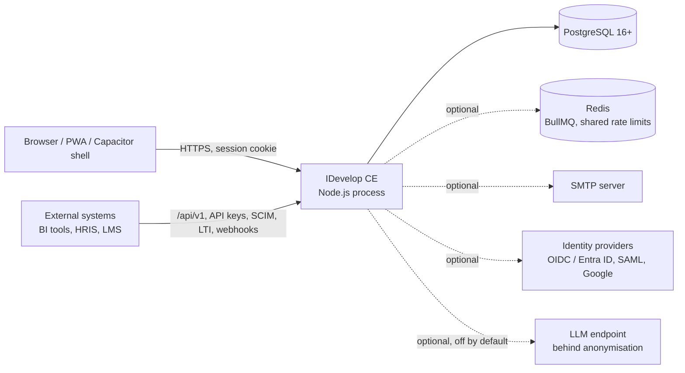
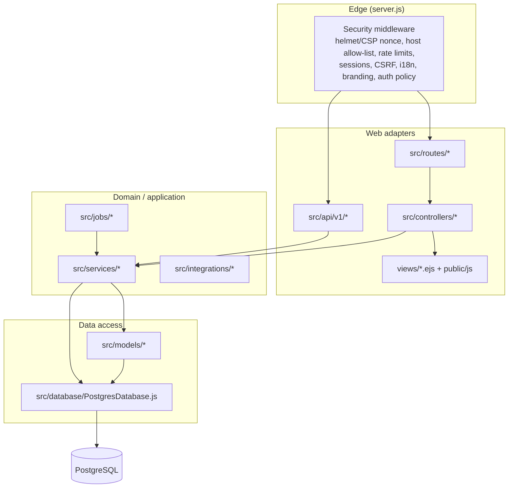

# Architecture

IDevelop Community Edition is a **layered, server-rendered monolith** on
Node.js/Express and PostgreSQL. It is deliberately boring to run — one process,
one database, optional Redis — and deliberately explicit about its seams, so that
any part can later be re-implemented in another framework or another language
without a big-bang rewrite.

This document explains the layers, the request lifecycle, the cross-cutting
subsystems, and — most importantly for long-term maintainers — **which artefacts
are language-neutral contracts** and how to replace a component safely.

---

## 1. System context

Everything optional degrades gracefully: without Redis, jobs run in-process under
a PostgreSQL advisory lock; without SMTP, notifications stay in-app; without an
IdP, local accounts with MFA are used.

## 2. Layers

| Layer            | Location                           | Responsibility                                                                                                          | Rules                                           |
| ---------------- | ---------------------------------- | ----------------------------------------------------------------------------------------------------------------------- | ----------------------------------------------- |
| Bootstrap / edge | `server.js`, `src/middleware/`     | Security headers, sessions, CSRF, rate limiting, i18n, branding, authentication and authorisation gates, error handling | No business logic                               |
| Routing          | `src/routes/`                      | URL → controller mapping, per-route permission guards                                                                   | Declarative; one router per feature area        |
| Controllers      | `src/controllers/`                 | Parse and validate input, call services, choose a view or JSON shape                                                    | Thin; no SQL in new code                        |
| Views            | `views/`, `public/`                | EJS templates, progressive-enhancement JS, CSS design tokens                                                            | Presentation only; strings come from `locales/` |
| Services         | `src/services/`                    | Business rules: readiness, calibration, campaigns, RBAC scope, audit, notifications…                                    | Framework-agnostic: no `req`/`res`, no Express  |
| Jobs             | `src/jobs/`                        | Scheduled work (digests, reminders, backups, retention)                                                                 | Call services; idempotent; claim-before-send    |
| Models           | `src/models/`                      | Table-oriented data access helpers                                                                                      | SQL only                                        |
| Database adapter | `src/database/`                    | Pooling, transactions, savepoints, migration runner, placeholder translation                                            | The only module that talks to `pg`              |
| Integrations     | `src/integrations/`, `src/api/v1/` | LMS/LTI/xAPI connectors, versioned JSON API                                                                             | Adapter pattern, one connector per protocol     |

The single database handle is `src/config/database.js`; it exposes `run`, `get`,
`all`, `runTransaction`, `runInSavepoint`, `migrate`, `seed` and `close`.
Transactions propagate through `AsyncLocalStorage`, so a service called inside
`db.runTransaction(...)` participates in the caller's transaction automatically.

## 3. Request lifecycle

1. **Static assets** (`public/`) are served before any session work.
2. **Security edge**: compression, host allow-list, HSTS, helmet with a per-request
   CSP nonce, body limits, request id, structured logging, API rate limits.
3. **Session & identity**: PostgreSQL-backed sessions (`connect-pg-simple`),
   Passport strategies, forced password change, MFA enrolment enforcement,
   per-user auth policy, activity trail.
4. **Locals**: locale (FR/EN), branding (`src/utils/branding.js`), permissions and
   navigation are resolved once and exposed to every view.
5. **Routing**: `/api/v1` (JSON) and `/` (HTML + feature routers under `/v2/*`).
6. **Errors**: a single `notFoundHandler` and `errorHandler` render HTML or JSON
   depending on what the client accepts.

## 4. Cross-cutting subsystems

| Concern        | Where                                                                              | Notes                                                                           |
| -------------- | ---------------------------------------------------------------------------------- | ------------------------------------------------------------------------------- |
| Authentication | `AuthService`, `SsoService`, `MfaService`, `src/config/sso.js`                     | Local (bcrypt), OIDC (incl. Entra ID), SAML 2.0, Google; TOTP with backup codes |
| Authorisation  | `src/config/permissions.js`, `RBACService`, `src/middleware/rbac.js`, `adminScope` | Capability slugs + organisational scopes (site / department / service)          |
| Audit          | `LogService`, migrations `52_*`, `120_*`, `124_*`                                  | Append-only, SHA-256 hash-chained, anchored externally by a job                 |
| Privacy        | `DSRService`, `AnonymizationService`, retention jobs                               | GDPR export/erasure, legal hold, tombstones re-applied after restore            |
| i18n           | `src/config/i18n.js`, `locales/{fr,en}/*.json`                                     | FR primary, EN fallback; no user-visible literal in code                        |
| Branding       | `src/config/product.js`, `src/utils/branding.js`, `public/css/style.css`           | Stock identity + runtime white-label (see `docs/BRAND.md`)                      |
| Jobs           | `src/jobs/index.js`                                                                | In-process scheduler with advisory lock, or BullMQ when `REDIS_URL` is set      |
| Observability  | `/health`, `/readyz`, `/metrics`                                                   | Prometheus text format, job-run ledger, health page for super-admins            |
| Offline        | `public/service-worker.js`, `public/js/draft-store.js`                             | Static-asset cache only; drafts in IndexedDB, replayed per owner                |

## 5. Language-neutral contracts

These artefacts are the product's real interfaces. They are plain files that any
implementation — in any language — can consume and be tested against.

| Contract             | File(s)                                                                       | Consumed by                                              |
| -------------------- | ----------------------------------------------------------------------------- | -------------------------------------------------------- |
| **Database schema**  | `db/postgres/01_schema.sql` + numbered migrations, tracked in `schema_meta`   | Every implementation; the schema is the system of record |
| **HTTP API**         | `docs/contracts/openapi.json` (generated from `src/api/v1/openapi.js`)        | External clients, alternative back ends, contract tests  |
| **UI strings**       | `locales/{fr,en}/*.json` (i18next format)                                     | Any front end                                            |
| **Design tokens**    | `:root` block of `public/css/style.css`; `docs/contracts/chart-identity.json` | Any front end or native shell                            |
| **Product identity** | `docs/contracts/product.json` (from `src/config/product.js`)                  | Front ends, packaging, e-mail templates                  |
| **Starter content**  | `db/postgres/seed-data/starter-framework.json`                                | Seeders in any language                                  |
| **Permissions**      | `src/config/permissions.js` (data-only module)                                | RBAC in any implementation                               |

`npm run contracts:export` regenerates `docs/contracts/`; the
`contractsInSync` test fails when code and published contract drift apart.

## 6. Replacing a component (framework or language migration)

The architecture supports an incremental **strangler-fig** migration. The
recommended order, from lowest to highest risk:

1. **Front end.** Build the new UI (any SPA framework or native app) against
   `/api/v1` and the contracts in §5. Extend the API — and the OpenAPI document —
   endpoint by endpoint as screens move over. Server-rendered EJS pages and the
   new UI can coexist behind the same session cookie.
2. **A bounded service.** Pick a feature area with a clear table boundary (for
   example reports, notifications or the LMS connectors). Re-implement it in the
   target language as a separate process that reads/writes the same PostgreSQL
   schema, put it behind a reverse proxy path, and retire the Node routes for it.
   The shared schema plus `schema_meta` keeps both runtimes honest.
3. **Jobs.** Jobs are idempotent and claim-before-send, so a job can be moved to
   another worker runtime by disabling it in `src/jobs/index.js` and running the
   replacement on the same schedule.
4. **The core.** Once the edge, UI and peripheral services have moved, the
   remaining Node process is a thin API over the same schema and can be replaced
   last.

Rules that keep this possible (enforced in review and, where noted, by tests):

- Business rules live in `src/services/`, never in controllers or views.
- No new SQL in controllers; add a service or model method instead.
- Every user-visible string goes through `locales/` (several i18n tests guard this).
- Every schema change is a new numbered, idempotent migration — never an edit to
  an applied one.
- Anything branded reads `src/config/product.js` or the branding layer; no literal
  product names or colours at call sites (`brandTokensAbsent`, `themeSingleSource`
  and `chartIdentity` tests guard this).
- The API is versioned; breaking changes go to `/api/v2`, not into `/api/v1`.

## 7. Deployment topologies

| Topology            | How                                                             | Notes                                                              |
| ------------------- | --------------------------------------------------------------- | ------------------------------------------------------------------ |
| Single host (Linux) | `npm start` behind a reverse proxy, PostgreSQL local or managed | Set `TRUST_PROXY=1` behind a proxy                                 |
| Containers          | `Dockerfile` / `docker-compose.yml`                             | Stateless app containers; scale horizontally with `REDIS_URL`      |
| Windows server      | `installer/`                                                    | Installs Node + PostgreSQL, registers a service, backups, rollback |
| Mobile shell        | `mobile/` (Capacitor)                                           | Wraps the PWA; points at your `SERVER_URL`                         |

## 8. Testing strategy

- **Unit + integration (Jest)** — ~5,000 tests; many run against a real
  PostgreSQL inside a rolled-back transaction. Source-pinning tests guard
  security-sensitive invariants (e.g. that a guard runs before a pool opens).
- **Fixture integration** — suites that need a populated organisation run only
  when `DATABASE_URL` names an `idevelop_fixtures` database.
- **Smoke (Playwright)** — login, CRUD, dashboards, scope isolation.
- **Static** — ESLint (incl. `eslint-plugin-security`), Prettier, icon lint,
  commitlint.
