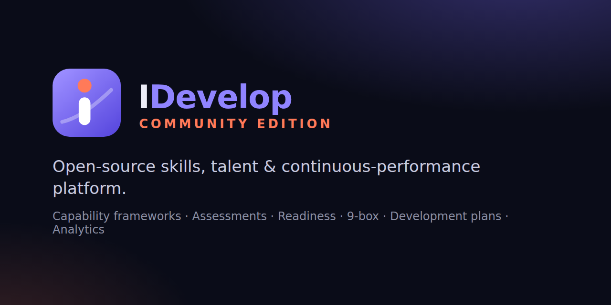

# IDevelop Community Edition — graphic chart

**Design language: "Open Horizon".** Friendly, light-first and airy: soft
lavender-white canvases, rounded surfaces, pill-shaped navigation and buttons,
gentle gradients instead of hard accent bars, and sentence-case labels in a warm
geometric typeface. One confident accent colour for action and focus, chosen by
each user from four colour themes. The identity says _growth, openness,
community_ — and it must never get in the way of reading data.

## 1. Logo

| Asset                              | File                                                                 | Use                                   |
| ---------------------------------- | -------------------------------------------------------------------- | ------------------------------------- |
| Mark (app icon)                    | `public/brand/idevelop-mark.svg`                                     | Sidebar, auth pages, About, app icons |
| Horizontal logo, dark backgrounds  | `public/brand/idevelop-logo.svg`                                     | README, docs, splash on dark          |
| Horizontal logo, light backgrounds | `public/brand/idevelop-logo-light.svg`                               | Print, light documents                |
| Favicon                            | `public/brand/favicon.svg`, `favicon-32.png`                         | Browser tabs                          |
| Apple touch icon                   | `public/brand/apple-touch-icon.png` (180 px)                         | iOS home screen                       |
| PWA icons                          | `public/icons/icon-192.png`, `icon-512.png`, `icon-512-maskable.png` | Install prompts, Android              |
| Social card                        | `public/brand/social-card.png` (1280×640)                            | Repository preview, `og:image`        |

**Construction.** A rounded tile (radius = 25 % of the side) filled with the Iris
gradient (`#9A8CFF` → `#5B4BE0`, top-left to bottom-right). A white rounded stem
forms the letter _i_; its dot is the Coral spark (`#FF7A59`). A translucent
ascending curve — the _horizon_ — rises behind the stem: progress along a path.

**Clear space** equals the dot's diameter on every side. **Minimum size**: 16 px
(favicon variant, which drops the horizon curve), 24 px for the full mark.

**Don'ts**: do not recolour the tile outside the Iris family, do not rotate or
stretch, do not place the mark on a busy photo without a solid backing, do not
use the Coral spark as a status colour.

**Wordmark**: "I" in the foreground text colour, "Develop" in Iris; the edition
line "COMMUNITY EDITION" in Coral, uppercase, tracking +2.6.

## 2. Colour

The interface theme lives in `public/css/horizon.css`. Each user chooses a
**mode** and a **colour theme** from the **Appearance** menu (palette icon in the
top bar); the choice is remembered per browser. Every combination is measured by
`tests/unit/horizonThemes.test.js`.

### 2.1 Modes

| Token                | Daylight (light, default) | Dusk (dark)        |
| -------------------- | ------------------------- | ------------------ |
| `--bg-base` (canvas) | `#F7F6FC`                 | `#18172C`          |
| `--bg-panel`         | `#FFFFFF`                 | `#1D1C35`          |
| `--bg-card`          | `#FFFFFF`                 | `#23213F`          |
| `--bg-elevated`      | `#F1EFF9`                 | `#2C2A4D`          |
| `--text-primary`     | `#1F1D3A` (14.3:1)        | `#F2F1FA` (12.1:1) |
| `--text-secondary`   | `#514F6B` (6.9:1)         | `#C4C2DA` (7.8:1)  |
| `--text-muted`       | `#63617D` (5.2:1)         | `#A9A7C4` (5.8:1)  |

Ratios are measured against the raised surface (`--bg-elevated`), the hardest case.

### 2.2 Colour themes

| Theme              | Light fill / text     | Dark fill / text      | White on light fill | Brand text on light card |
| ------------------ | --------------------- | --------------------- | ------------------- | ------------------------ |
| **Iris** (default) | `#5B4BE0` / `#4E3FD0` | `#8B7DFF` / `#A99FFF` | 5.95:1              | 7.13:1                   |
| **Meadow**         | `#1D7F55` / `#17734C` | `#43C08A` / `#6AD3A4` | 4.98:1              | 5.84:1                   |
| **Sunrise**        | `#C2410C` / `#B13A0A` | `#FF8A5C` / `#FFA784` | 5.18:1              | 6.04:1                   |
| **Ocean**          | `#1D6AC9` / `#195FB6` | `#5FA2FF` / `#8BBBFF` | 5.31:1              | 6.26:1                   |

In Dusk mode, buttons use dark ink on the brand fill (5.4–7.6:1) and brand text
clears 5.9:1 on every surface. Decorative gradients (avatars, the help button)
pair the brand with a friendly second colour per theme (Iris + Coral, Meadow +
Lagoon, Sunrise + Honey, Ocean + Iris). The **Coral spark** `#FF7A59` belongs to
the logo and highlights; it is never a status colour.

An organisation's own accent (Settings → Branding) overrides the colour theme for
everyone on that installation.

### 2.3 Interface language

| Element      | Rule                                                                           |
| ------------ | ------------------------------------------------------------------------------ |
| Radii        | 8 / 12 / 18 / 24 px; pills (999 px) for buttons, navigation, badges, search    |
| Shadows      | Soft and diffuse (ink-tinted in Daylight); no hard borders on cards            |
| Page banners | Brand-tinted gradient with a soft spark glow; icon in a white tile             |
| Navigation   | Airy sidebar, sentence-case section labels, pill highlight for the active page |
| Tables       | Sentence-case headers on a raised row, brand-tinted hover                      |
| Canvas       | Two large, faint radial glows (brand and spark) — no grid texture              |

Status colours (`--emerald`, `--amber`, `--red`, `--blue` and their `-text`
variants) keep their meaning in every theme and are never replaced by the brand.

### 2.4 Data-visualisation palette ("Horizon")

Defined once in `src/utils/branding.js` (`CHART_IDENTITY.community`) and emitted
as `--chart-*` custom properties; exported to `docs/contracts/chart-identity.json`.

| Slot | Name  | Hex       | vs dark card `#151931` | vs white |
| ---- | ----- | --------- | ---------------------- | -------- |
| 1    | Iris  | `#7C6CFF` | 4.48:1                 | 3.86:1   |
| 2    | Rose  | `#CA72A7` | 5.33:1                 | 3.24:1   |
| 3    | Coral | `#DF5920` | 4.60:1                 | 3.76:1   |
| 4    | Slate | `#626A84` | 3.22:1                 | 5.37:1   |
| 5    | Ochre | `#8F8314` | 4.46:1                 | 3.87:1   |
| 6    | Sky   | `#187EAA` | 3.79:1                 | 4.56:1   |
| 7    | Lime  | `#728D35` | 4.59:1                 | 3.77:1   |
| 8    | Teal  | `#17A1A1` | 5.47:1                 | 3.16:1   |

| Semantic | Hex       | vs dark | vs white |
| -------- | --------- | ------- | -------- |
| Good     | `#1F7A56` | 3.27:1  | 5.28:1   |
| Warning  | `#866F13` | 3.54:1  | 4.89:1   |
| Danger   | `#E02929` | 3.72:1  | 4.65:1   |
| Neutral  | `#187EAA` | 3.79:1  | 4.56:1   |

Rules, all enforced by `tests/unit/chartIdentity.test.js`:

- every categorical and semantic colour clears **3:1** (WCAG 1.4.11) on both
  chart surfaces;
- adjacent series stay ≥ **20 ΔE** apart and every pair ≥ **12 ΔE** in simulated
  deuteranopia and protanopia (achieved: 52 and 13.5);
- warning vs danger ≥ **20 ΔE** under deuteranopia (achieved: 35.6);
- a marker-shape cycle (circle, diamond, triangle, square, rounded square) gives
  series a second, non-colour channel;
- the heat scale is never red-versus-green alone.

## 3. Typography

System font stacks by default, so the product renders identically offline and on
air-gapped hosts. Labels are sentence case in the body face; monospace is kept
for code only, and figures use tabular numbers. When external fonts are allowed, **Plus Jakarta Sans** (UI —
open, friendly geometric humanist) and **JetBrains Mono** (numbers, codes,
identifiers) are loaded from Google Fonts; both are licensed under the SIL Open
Font License. Set `DISABLE_EXTERNAL_FONTS=1` to forbid any external request.

| Use (guidance)        | Size / weight                                |
| --------------------- | -------------------------------------------- |
| Page title            | 1.75 rem / 700                               |
| Section title         | 1.25 rem / 700                               |
| Body                  | 0.95–1 rem / 400                             |
| Labels, table headers | 0.72 rem / 700, uppercase, tracking +0.06 em |
| Numbers in KPIs       | tabular figures, 700                         |

## 4. Iconography

Font Awesome Free 6 (self-hosted under `public/vendor/fontawesome/`). No
pictographic emoji in the UI — `npm run lint:icons` fails the build if one
appears in a view.

## 5. Voice

Plain, specific and honest. Say what the number means and what it does _not_
cover ("5 of 5 dimensions not measured", never a fake 0 %). Bilingual parity:
every string exists in French and English.

## 6. Re-branding

| You want to…                                                                           | Change                                                                                                                                                                                  |
| -------------------------------------------------------------------------------------- | --------------------------------------------------------------------------------------------------------------------------------------------------------------------------------------- |
| Put your organisation's name, logo, favicon, tagline, accent colour on an installation | _Settings → Branding_ (no code; stored in the database)                                                                                                                                 |
| Ship a fork with a different stock identity                                            | `src/config/product.js`, `public/brand/*`, `public/icons/*`, the `:root` tokens in `public/css/style.css`, `CHART_IDENTITY` in `src/utils/branding.js`, then `npm run contracts:export` |

The AGPL covers the code, not the name or the logo — see `NOTICE`.
